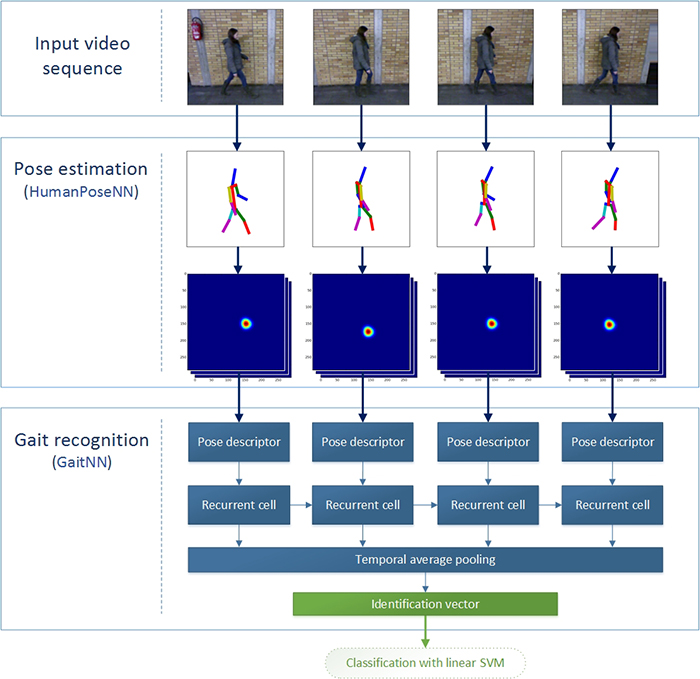

# DNN for gait recognition in TensorFlow

In this project you can find implementation of deep neural network for **people identification from video** by the characteristic of their **gait**. The processing is very robust against various covariate factors such as *clothing*, *carrying conditions*, *shoe types* and so on. Feel free to use this network in your project or extend it in some way.

## Requirements

The code was written in `Python 3.5`, but it is probably also compatible with other versions. 

### Python packages

- `TensorFlow 1.0` - [how to install](https://www.tensorflow.org/install/)
- `numpy`, `scipy`, `PIL`

## Basic information about architecture

The network takes *raw RGB video frames* of walker as an input and produces one-dimensional vector - **gait descriptor** that exposes as an identification vector. The identification vectors from gaits of each two different people should be **linearly separable**. Whole network consists of two sub-networks connected in cascade - `HumanPoseNN` and `GaitNN`.

**Spatial features** from the video frames are extracted according to the descriptors that involve **pose of the walker**. These descriptors are generated from the first sub-network - `HumanPoseNN` defined in `human_pose_nn` module. `HumanPoseNN` can be also used as a standalone network for regular **2D pose estimation problem** from still images (for more info see [this section](#pose-estimation)).

Responsibility of the second sub-network - `GaitNN` is the further processing of the generated spatial features into one-dimensional **pose descriptors** with the use of a residual convolutional network. **Temporal features** are then extracted across these *pose descriptors* with the use of the multilayer recurrent cells - **LSTM** or **GRU**. All temporal features are finally aggregated with **Average temporal pooling** into one-dimensional **identification vectors** with discriminatory properties. As already mentioned in the text above, the human identification vectors are linearly separable with each other and can therefore be classified with e.g. **linear SVM**.



## Gait recognition

The dummy code bellow show how to generate the identification vector form input data `video_frames`. All frames should include the entire person that is visible from the profile view. The person should be located approximately in the center of each frame. 

```python
# Initialize computational graphs of both sub-networks
net_pose = HumanPoseIRNetwork()
net_gait = GaitNetwork(recurrent_unit = 'GRU', rnn_layers = 2)

# Load pre-trained models
net_pose.restore('path/to/pose_checkpoint.ckpt')
net_gait.restore('path/to/gait_checkpoint.ckpt')

# Create features from input frames in shape (TIME, HEIGHT, WIDTH, CHANNELS) 
spatial_features = net_pose.feed_forward_features(video_frames)

# Process spatial features and generate identification vector 
identification_vector = net_gait.feed_forward(spatial_features)
```

<!--e.g. in [this work](https://arxiv.org/abs/1403.6950).-->

## Pose estimation

The first sub-network - `HumanPoseNN` that generates features for the second - `GaitNN` can be also used as a standalone network for 2D **pose estimation problem**. This can be done in such a way:

```python
net_pose = HumanPoseIRNetwork()

# Restore pre-trained model
net_pose.restore('path/to/pose_checkpoint.ckpt')

# input_images should contains RGB images (299 x 299) to be processed.
# The images in batch should be stacked along the first dimension, so the shape of input_images 
# has to be (BATCH, 299, 299, 3)
coords_y, coords_x, probabilities = net_pose.joint_positions(input_images)
```
where `coords_y`, `coords_x` and `probabilities` stores estimated joint coordinates in **Y axis**, **X axis** and **probability** of each estimate, respectively. All these tensors have shape `(BATCH, 16)`, where the second dimension is the body joint. The order of the body joints in the second dimension is as follows:

```
1. right ankle 
2. right knee 
3. right hip
4. left hip
5. left knee
6. left ankle
7. pelvis
8. thorax
9. upper neck
10. head top *(in human3.6m - head middle)*
11. right wrist
12. right elbow
13. right shoulder
14. left shoulder
15. left elbow
16. left wrist
```

If you want to get raw heat maps that maps dense probability distribution for each pixel in image, instead of method `joint_positions` use method `heat_maps` - you should get heat maps with shape `(BATCH, HEIGHT, WIDTH, 16)`. 

#### Dummy pose estimation

If you run script `dummy_pose_estimation.py`, the dummy image located in */images/dummy.jpg* will be processed and the pose of human should be displayed in new created image - */images/dummy_pose.jpg*. For doing this you must have the `matplotlib` package installed and have pre-trained model `MPII+LSP` stored in */models/MPII+LSP.ckpt* - for getting pre-trained models check the next section. The generated image in */images/dummy_pose.jpg* should looks like this one:


Printed probabilities of each estimate:

```
right ankle : 85.80%
right knee : 80.27%
right hip: 85.40%
left hip: 80.01%
left knee: 83.32%
left ankle: 92.08%
pelvis: 88.84%
thorax: 96.41%
upper neck: 97.40%
head top: 88.81%
right wrist: 87.90%
right elbow: 88.85%
right shoulder: 91.30%
left shoulder: 93.63%
left elbow: 92.31%
left wrist: 94.24%
```

## Pre-trained models

Checkpoints for network `HumanPoseNN`:<br>
[Human3.6m.ckpt](http://www.st.fmph.uniba.sk/~margeta2/models/Human3.6m.ckpt) - trained on [Human 3.6m](http://vision.imar.ro/human3.6m/description.php), action *walking*<br>
[MPII+LSP.ckpt](http://www.st.fmph.uniba.sk/~margeta2/models/MPII+LSP.ckpt) - trained on [MPII](http://human-pose.mpi-inf.mpg.de) and [LSP](http://www.comp.leeds.ac.uk/mat4saj/lsp.html) database

Checkpoints for network `GaitNN`:<br>
[H3.6m-GRU-1.ckpt](http://www.st.fmph.uniba.sk/~margeta2/models/H3.6m-GRU-1.ckpt)<br>
[M+L-GRU-2.ckpt](http://www.st.fmph.uniba.sk/~margeta2/models/M+L-GRU-2.ckpt)

The name describe used architecture (model-RNNcell-layers), so e.g. checkpoint `H3.6m-GRU-1.ckpt` should be loaded in this way:
```python
net_pose = HumanPoseIRNetwork()
net_gait = GaitNetwork(recurrent_unit = 'GRU', rnn_layers = 1)

# Load pre-trained models
net_pose.restore('./Human3.6m.ckpt')
net_gait.restore('./H3.6m-GRU-1.ckpt')
```
